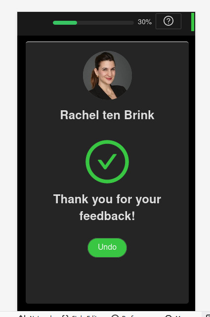

# Mentor Matching Machine

This projects consists of a SPA(single page application) with multiple views, these views which are divided into the Mentor Madness(scheduling), Survey Application, and finally the Data Dashboard.

# Mentor Madness
## Description

This is where the programm manager, or assiociates will assemble the meetings between mentors and companies.

This project has 4 general views
* Generate Meetings, this loads a CSV file through drag and drop, drag file and drop in a specified area, the CSV file contains all the companies that corresponds to each mentor, after the file was loaded, it will re-route you to the next niew.
* Meetings Table, this has a time table where each row will be a mentor that is going to have meetings in timeblocks assigned to companies in the columns, you could modify the display by filtering through mentors, companies, time blocks, days.
* Schedule, will display all the mentors that havent been asigned for a meeting with a company, due to cancelation by mentor, or haven't picked a time frame for the meeting, this could be filtered by mentors, companies, time blocks, and days.
* Add & Delete Mentors, as its name implies, it will allow the staff to add new mentors or remove them from the Techstars programm.

# Survey Filling App

## Description

In the project directory, you can run:

### `npm start`

Runs the app in the development mode.\
Open [http://localhost:3000/survey](http://localhost:3000/survey) to view it in the browser.
to display the surveys for mentors or companies, you must put the mentor id or the
company id after "survey/" in the URL.

The page will reload if you update the components.\
You will also see any lint errors in the console.

The mentors and the companies will access through an URL that was sent to their e-mail.

### Installing Packets
`npm install axios`
`npm install react-card-flip`
`npm install antd`
`npm install react-custom-scrollbars`
`npm install react-router-dom`

These are all the packets needed to run and build the app.

### Functional Components

Most of this aplication was built as a SPA(single page application) made of functional components
with useState and useEffect hooks.

## Name.jsx

This component will use Survey.jsx, HeaderMent.jsx, HeaderComp.jsx and Data.jsx to display the survey cards in a grid fashion using the '\<Row>\' and '\<Col>\' from the 'antd' package.
from Data.jsx will be fetched the number of elements to be displayed according to who the client is(company or mentor) and it will display only the meetings
that already happened.
HeaderMent.jsx or HeaderComp.jsx are the headers that contain the progress bar and the '?' button

There is a function that determines which of these headers are going to be displayed.
The '?' button will display the "survey instructions"

This component will check if any survey was answered before, it will display the progress bar with how many of the survey cards are not submitted.

## Survey.jsx

This component will use '<ReactCardFlip>' from 'react-card-flip' package, it will allow the survey cards to do a flip animation when submitted or to edit by pressing undo.

this component uses a lot of props that comes from Name.jsx, these props will update the display of the survey cards components, such as:
* "\<Avatar>\" from antd package
* "\\"{props.meetings}"\\"regular html span that displays company or mentor name
* "<Radio.Group>" from antd will contain "<Radio.Button>" which will be used for the voting of Want To, Willing To, Won't
* "\<Slider>\" from antd will be a dragging element from 1 to 5 marks
* "<textarea>" regular html element
* "\<Button>\" from antd will take care of the data submit and the undo
When you hit submit button, the card will flip showing the back of the survey card.

## Data.jsx
This uses axios package to get data from the endpoints.

## TutorialComp.jsx
This uses Modal from 'antd' and is displayed if the client represents a company

## TutorialMent.jsx
This uses Modal from 'antd' and is displayed if the client represents a mentor
